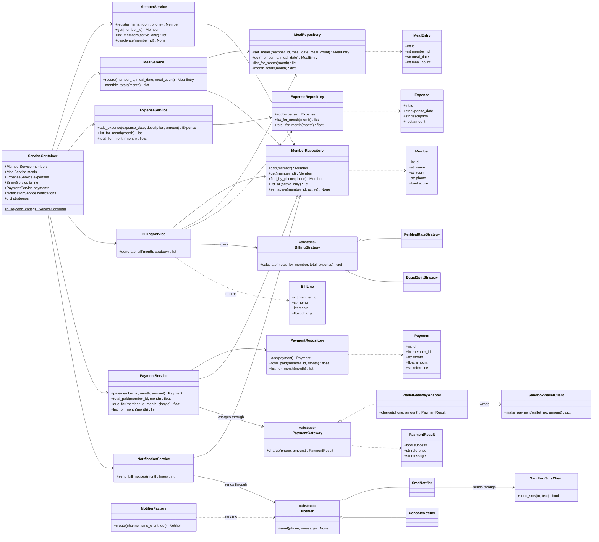

# UML Class Diagram

Class structure and relationships across models, repositories, services, strategies, adapters, factories, and the dependency container in the final codebase:

```mermaid
classDiagram
    direction LR

    class Member {
        +int id
        +str name
        +str room
        +str phone
        +bool active
    }
    class MealEntry {
        +int id
        +int member_id
        +str meal_date
        +int meal_count
    }
    class Expense {
        +int id
        +str expense_date
        +str description
        +float amount
    }
    class Payment {
        +int id
        +int member_id
        +str month
        +float amount
        +str reference
    }
    class BillLine {
        +int member_id
        +str name
        +int meals
        +float charge
    }

    class MemberRepository {
        +add(member) Member
        +get(member_id) Member
        +find_by_phone(phone) Member
        +list_all(active_only) list
        +set_active(member_id, active) None
    }
    class MealRepository {
        +set_meals(member_id, meal_date, meal_count) MealEntry
        +get(member_id, meal_date) MealEntry
        +list_for_month(month) list
        +month_totals(month) dict
    }
    class ExpenseRepository {
        +add(expense) Expense
        +list_for_month(month) list
        +total_for_month(month) float
    }
    class PaymentRepository {
        +add(payment) Payment
        +total_paid(member_id, month) float
        +list_for_month(month) list
    }

    class MemberService {
        +register(name, room, phone) Member
        +get(member_id) Member
        +list_members(active_only) list
        +deactivate(member_id) None
    }
    class MealService {
        +record(member_id, meal_date, meal_count) MealEntry
        +monthly_totals(month) dict
    }
    class ExpenseService {
        +add_expense(expense_date, description, amount) Expense
        +list_for_month(month) list
        +total_for_month(month) float
    }
    class BillingService {
        +generate_bill(month, strategy) list
    }
    class PaymentService {
        +pay(member_id, month, amount) Payment
        +total_paid(member_id, month) float
        +due_for(member_id, month, charge) float
        +list_for_month(month) list
    }
    class NotificationService {
        +send_bill_notices(month, lines) int
    }

    class BillingStrategy {
        <<abstract>>
        +calculate(meals_by_member, total_expense) dict
    }
    class PerMealRateStrategy
    class EqualSplitStrategy

    class PaymentGateway {
        <<abstract>>
        +charge(phone, amount) PaymentResult
    }
    class WalletGatewayAdapter {
        +charge(phone, amount) PaymentResult
    }
    class SandboxWalletClient {
        +make_payment(wallet_no, amount) dict
    }
    class PaymentResult {
        +bool success
        +str reference
        +str message
    }

    class Notifier {
        <<abstract>>
        +send(phone, message) None
    }
    class SmsNotifier
    class ConsoleNotifier
    class SandboxSmsClient {
        +send_sms(to, text) bool
    }
    class NotifierFactory {
        +create(channel, sms_client, out) Notifier
    }

    class ServiceContainer {
        +MemberService members
        +MealService meals
        +ExpenseService expenses
        +BillingService billing
        +PaymentService payments
        +NotificationService notifications
        +dict strategies
        +build(conn, config)$ ServiceContainer
    }

    MemberService --> MemberRepository
    MealService --> MealRepository
    MealService --> MemberRepository
    ExpenseService --> ExpenseRepository
    BillingService --> MemberRepository
    BillingService --> MealRepository
    BillingService --> ExpenseRepository
    BillingService --> BillingStrategy : uses
    BillingService ..> BillLine : returns
    PaymentService --> PaymentRepository
    PaymentService --> MemberRepository
    PaymentService --> PaymentGateway : charges through
    NotificationService --> MemberRepository
    NotificationService --> Notifier : sends through

    BillingStrategy <|-- PerMealRateStrategy
    BillingStrategy <|-- EqualSplitStrategy

    PaymentGateway <|.. WalletGatewayAdapter
    WalletGatewayAdapter --> SandboxWalletClient : wraps
    PaymentGateway ..> PaymentResult

    Notifier <|-- SmsNotifier
    Notifier <|-- ConsoleNotifier
    SmsNotifier --> SandboxSmsClient : sends through
    NotifierFactory ..> Notifier : creates

    ServiceContainer --> MemberService
    ServiceContainer --> MealService
    ServiceContainer --> ExpenseService
    ServiceContainer --> BillingService
    ServiceContainer --> PaymentService
    ServiceContainer --> NotificationService

    MemberRepository ..> Member
    MealRepository ..> MealEntry
    ExpenseRepository ..> Expense
    PaymentRepository ..> Payment
```
